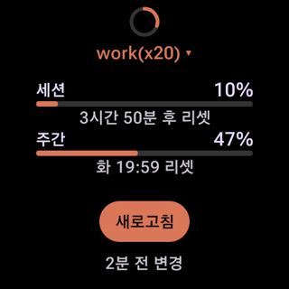
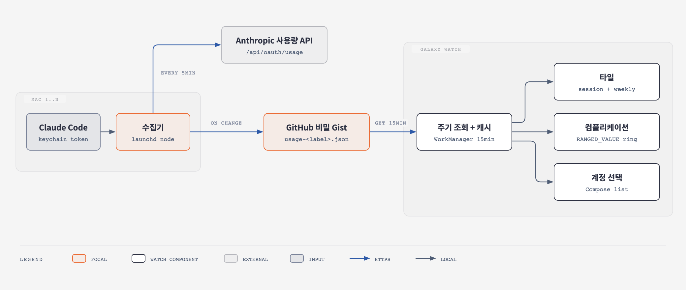

# Galaxy Watch Claude 사용량 모니터

손목을 들면 Claude 구독 한도가 몇 % 찼는지 바로 보인다.

5시간 세션과 주간 한도, 각각 언제 리셋되는지까지 보여 준다.

개인/회사처럼 계정이 여러 개면 워치에서 골라 본다.



- **서버 없음, 비용 0원**

  중간 저장소는 GitHub 비밀 Gist 하나다.

- **Mac이 꺼져 있어도 값이 틀리지 않음**

  워치가 리셋 시각을 직접 계산해서, 지난 항목은 0%로 보여 준다.

- **토큰은 Mac 밖으로 나가지 않음**

  워치에는 비밀키가 없다.

설계 배경은 [`docs/PRD.md`](docs/PRD.md), 테스트 목록은 [`docs/IMPLEMENTATION_PLAN.md`](docs/IMPLEMENTATION_PLAN.md)에 있다.

---

## 어떻게 동작하나



1. **Mac 수집기** (`collector/`)가 launchd로 5분마다 실행된다.

   Claude Code가 키체인에 저장해 둔 토큰으로 Anthropic 사용량 API를 조회한다.

   토큰 갱신은 하지 않고 읽기만 한다.

2. 응답을 짧은 JSON으로 바꿔서 직전 값과 비교한다.

   **바뀌었을 때만** Gist의 `usage-<라벨>.json`을 덮어쓴다.

   이메일은 올리지 않는다.

3. **워치 앱** (`watch/`)이 15분마다 Gist를 읽어서 계정별로 저장해 둔다.

   타일에서 새로고침을 누르면 바로 읽는다.

4. 타일, 컴플리케이션, 계정 선택 화면은 저장해 둔 값만 읽는다.

   그리기 직전에 리셋 시각이 지났는지 계산한다.

| 구성 | 기술 | 하는 일 |
|------|------|---------|
| 수집기 | TypeScript, Node 24, launchd | 계정 인식, 사용량 조회, 바뀐 값만 업로드 |
| 릴레이 | GitHub 비밀 Gist | 계정마다 파일 1개 |
| 워치 앱 | Kotlin, Wear OS 6 | 조회, 저장, 표시, 계정 선택, 알림 |

### 여러 Mac, 여러 계정

- Mac마다 수집기를 설치한다.

  각 Mac은 **지금 Claude Code에 로그인된 계정**의 파일만 올린다.

- 모든 Mac이 **같은 Gist**를 쓴다.

  워치는 Gist 안의 `usage-*.json` 목록으로 계정 목록을 만든다.

- 같은 계정을 두 Mac에서 쓰면 같은 파일에 쓴다.

  값이 같아서 문제없다.

- 워치에 보이는 이름은 수집기 설정의 `accounts` 매핑으로 정한다.

  매핑이 없으면 이메일 `@` 앞부분이 이름이 된다.

### 화면

| 화면 | 내용 |
|------|------|
| 타일 | 계정 이름, 세션 %, 주간 %, 리셋 시각, 새로고침, 마지막 변경 시각 |
| 컴플리케이션 | 워치페이스 링. 60% 이상 주황, 85% 이상 빨강 |
| 계정 선택 | 계정별 세션/주간 %. 고르면 타일과 컴플리케이션이 같이 바뀜 |
| 알림 | 세션 80%, 95% 도달 시 진동. 100% 찍은 세션이 리셋되면 알림 |

### 상태별 표시

| 상황 | 워치 표시 |
|------|-----------|
| 정상 | 값 + "N분 전 변경" |
| Mac 꺼짐 | 마지막 값 그대로. 리셋 시각이 지나면 0% |
| 토큰 만료 | "수집 오류 (Claude Code 실행 필요)" |
| API 형식 변경 | "수집 오류" |
| 한 번도 못 받음 | "데이터 없음. 수집기 확인" |

---

## 에이전트용 설치 가이드

> Claude Code 같은 코딩 에이전트가 새 Mac에서 그대로 따라 하도록 쓴 절차다.
>
> 사람도 똑같이 따라 하면 된다.

### 0. 규칙

- 토큰 값을 로그, 커밋, 파일, 대화 출력에 남기지 않는다. 키체인에만 넣는다.

- `~/.config/claude-watch/config.json`은 저장소에 커밋하지 않는다.

- 이미 설치된 Mac이면 각 단계의 **확인** 명령으로 건너뛸지 판단한다.

  모든 단계는 다시 실행해도 안전하다.

- 키체인 팝업, 워치 페어링 코드처럼 사람 손이 필요한 곳에서는 멈추고 사용자에게 요청한다.

### 1. 사용자에게 받을 값

| 값 | 설명 |
|----|------|
| `GIST_ID` | 비밀 Gist ID. 다른 Mac과 **같은 값** |
| GitHub 토큰 | Fine-grained PAT. 권한은 **Gists: Read and write** 하나만 |
| 계정 매핑 | 이 Mac의 Claude 계정 이메일과 워치에 보일 이름 |

**없을 때**

- **Gist:** 사용자가 <https://gist.github.com> 에서 **Create secret gist**로 만들고, 주소 끝 ID를 알려 준다.

- **토큰:** 사용자가 <https://github.com/settings/personal-access-tokens/new> 에서 발급한다.

  다른 Mac과 같은 토큰을 써도 된다.

- **매핑:** 없으면 이메일 `@` 앞부분이 이름이 된다.

  이름에는 영문, 숫자, `.`, `_`, `-`, 괄호만 쓴다. 나머지 문자는 `-`로 바뀐다.

### 2. 사전 조건 확인

```bash
node --version                                      # v24 이상
test -f ~/.claude.json && echo "Claude Code 로그인 파일 있음"
security find-generic-password -s "Claude Code-credentials" >/dev/null && echo "Claude Code 토큰 있음"
```

- Node가 24 미만이면 설치를 요청한다. (nvm이면 `nvm install 24`)

- Claude Code 로그인이 없으면 `claude` 실행 후 `/login`을 요청한다.

### 3. 저장소 받기

```bash
git clone git@github.com:imkdw/galaxy-watch-claude-monitor.git ~/galaxy-watch-claude-monitor
cd ~/galaxy-watch-claude-monitor/collector
```

수집기는 런타임 의존성이 없어서 `npm install` 없이 실행된다.

`npm install`은 타입 검사와 테스트를 돌릴 때만 필요하다.

### 4. 설정 파일

**확인:** `cat ~/.config/claude-watch/config.json`

이미 있으면 `gistId`가 같은지 보고, `accounts`에 이 Mac의 계정만 추가한다.

```bash
mkdir -p ~/.config/claude-watch
cat > ~/.config/claude-watch/config.json <<'JSON'
{
  "gistId": "<GIST_ID>",
  "accounts": {
    "<이메일>": "<라벨>"
  }
}
JSON
chmod 600 ~/.config/claude-watch/config.json
```

### 5. GitHub 토큰을 키체인에 저장

**확인:** `security find-generic-password -s claude-watch-github >/dev/null && echo 있음`

```bash
security add-generic-password -U -s claude-watch-github -a "$USER" -w '<PAT>'
```

토큰이 맞는지 확인한다. 200이 나와야 한다.

```bash
curl -s -o /dev/null -w "%{http_code}\n" \
  -H "Authorization: Bearer $(security find-generic-password -s claude-watch-github -w)" \
  https://api.github.com/gists/<GIST_ID>
```

### 6. 한 번 돌려 보기

```bash
npm run dry     # 업로드 없이 JSON만 출력
```

- 처음에는 키체인 팝업이 뜬다.

  **사용자에게 "항상 허용"을 눌러 달라고 요청한다.**

  이걸 안 하면 launchd 백그라운드 실행이 팝업에서 멈춘다.

- 출력 JSON의 `account`가 원하는 이름인지, `session.pct`와 `weekly.pct`가 숫자인지 확인한다.

```bash
npm start       # 실제 업로드. "usage-<라벨>.json 업로드" 로그
npm start       # 두 번째는 "변경 없음"이어야 함
```

### 7. launchd 등록

```bash
scripts/install.sh                         # 5분마다 실행. 다시 실행하면 재등록
launchctl list | grep claude-watch         # 두 번째 칸이 0이면 정상
tail -n 5 ~/Library/Logs/claude-watch.log  # 5분마다 한 줄 이상
```

nvm으로 Node 버전을 바꾸면 `scripts/install.sh`를 다시 실행한다.

plist에 node 절대 경로가 들어가 있기 때문이다.

### 8. 워치 앱 (워치 한 대에 한 번만)

이미 워치에 설치돼 있으면 건너뛴다.

Mac을 추가해도 워치는 다시 설치할 필요가 없다. 새 계정은 다음 조회 때 목록에 뜬다.

**필요한 것:** Android SDK Platform 37, JDK 17, Android Studio

```bash
cd ~/galaxy-watch-claude-monitor/watch
printf 'sdk.dir=%s\ngistId=%s\n' "$HOME/Library/Android/sdk" "<GIST_ID>" > local.properties
```

**무선 디버깅 연결 (사용자 손이 필요)**

아래를 사용자에게 요청하고, 워치 화면의 **6자리 코드**를 받는다.

1. 워치 설정 > 워치 정보 > 소프트웨어 정보 > **소프트웨어 버전**을 5번 탭

   (개발자 옵션이 켜진다)

2. 설정 > 개발자 옵션 > **ADB 디버깅**, **무선 디버깅** 켜기

   (Mac과 같은 와이파이)

3. **새 기기 페어링** 화면을 띄운 채로 6자리 코드를 알려 주기

**설치**

```bash
ADB=~/Library/Android/sdk/platform-tools/adb
$ADB mdns services                          # pairing 포트와 connect 포트 확인
$ADB pair <IP>:<pairing 포트> <6자리 코드>
$ADB connect <IP>:<connect 포트>
ANDROID_SERIAL=<IP>:<connect 포트> ./gradlew installDebug
$ADB -s <IP>:<connect 포트> shell pm grant dev.imkdw.claudewatch android.permission.POST_NOTIFICATIONS
```

- 포트는 사용자가 말한 값이 아니라 `adb mdns services`에 나온 값을 쓴다.

- 페어링 창을 닫았다 열면 포트와 코드가 바뀐다. 실패하면 코드를 다시 받는다.

- 워치 화면이 꺼지면 connect 포트가 바뀔 수 있다. `adb mdns services`로 다시 찾는다.

**설치 후 사용자에게 확인 요청**

1. 워치페이스에서 왼쪽으로 넘겨 **Claude 사용량** 타일이 있는지

   없으면 타일 편집에서 추가한다.

2. 워치페이스 편집에서 컴플리케이션 칸에 **Claude 세션**을 넣을 수 있는지

   삼성 워치페이스 일부는 안 된다.

### 9. 문제 해결

| 로그 / 증상 | 조치 |
|-------------|------|
| `설정 파일 ... 가 없음` | 4단계 |
| `키체인 항목 ... 읽을 수 없음` | 터미널에서 `npm run dry` 후 "항상 허용" |
| `사용량 API 인증 실패 HTTP 401` | Claude Code 한 번 실행 |
| `경고: ... 매핑에 없어` | `config.json`의 `accounts`에 추가 |
| `Gist 업로드 실패 HTTP 401/404` | 5단계, 4단계 다시 |
| `네트워크 오류로 건너뜀` | 없음. 다음 실행 때 자동 |
| 워치에 옛 계정 이름이 남음 | Gist에서 옛 `usage-<옛 라벨>.json` 삭제 |

**제거**

```bash
~/galaxy-watch-claude-monitor/collector/scripts/install.sh --uninstall
rm -rf ~/.config/claude-watch
security delete-generic-password -s claude-watch-github
```

---

## 개발

```bash
make test                                   # 수집기 + 워치 JVM 테스트
```

**수집기**

```bash
cd collector
npm install && npm run check                # 타입 검사 + 테스트
npm run coverage                            # 라인 커버리지 90% 미만이면 실패
```

**워치**

```bash
cd watch
./gradlew testDebugUnitTest lintDebug       # JVM + Robolectric, 린트
./gradlew koverVerify koverLog              # 커버리지 90% 미만이면 실패
ANDROID_SERIAL=<에뮬레이터> ./gradlew connectedDebugAndroidTest
```

- 테스트는 실제 키체인, 네트워크, 홈 디렉터리를 건드리지 않는다.

- 수집기와 워치는 코드를 공유하지 않는다.

  대신 `fixtures/`의 같은 JSON을 양쪽 테스트가 읽어서 형식이 어긋나는 걸 잡는다.

### 에뮬레이터에서 가짜 Gist로 화면 보기

debug 빌드는 호스트(`10.0.2.2`)로 평문 통신을 허용한다.

`local.properties`에 두 줄을 넣고 로컬 서버를 띄운다. 확인이 끝나면 두 줄을 지운다.

```properties
gistId=demo
gistApiBase=http://10.0.2.2:8765/
```

```bash
mkdir -p /tmp/fakegist/gists && cp fixtures/gist-response.json /tmp/fakegist/gists/demo
(cd /tmp/fakegist && python3 -m http.server 8765 --bind 127.0.0.1)
```

픽스처의 리셋 시각은 과거라서 0%로 보인다. 값을 보려면 `resetsAt`을 미래 시각으로 바꾼다.

### 폴더

```
docs/        PRD, 구현 계획, 목업, 다이어그램
fixtures/    수집기와 워치가 함께 쓰는 계약 픽스처
collector/   Mac 수집기 (TypeScript)
watch/       워치 앱 (Android Studio 프로젝트)
```

구조도 원본은 [`docs/diagrams/architecture.html`](docs/diagrams/architecture.html)이다.
